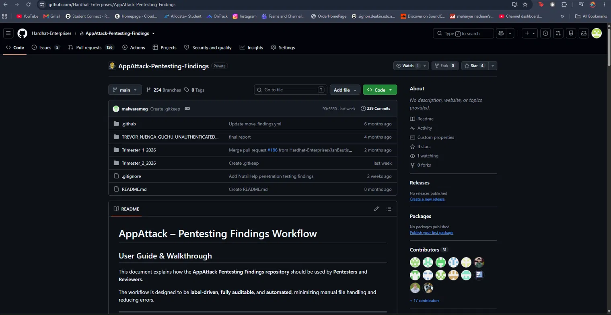
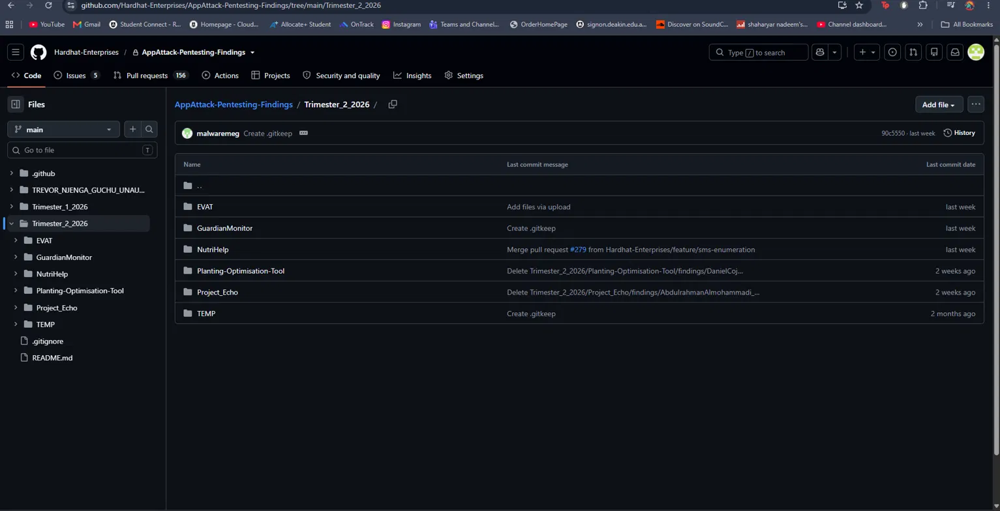
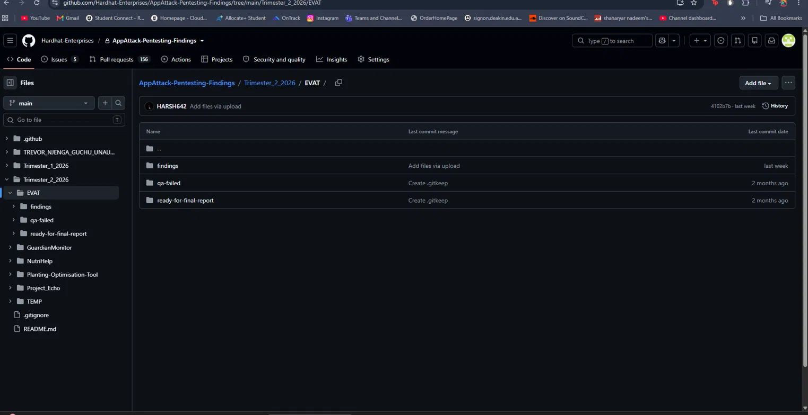
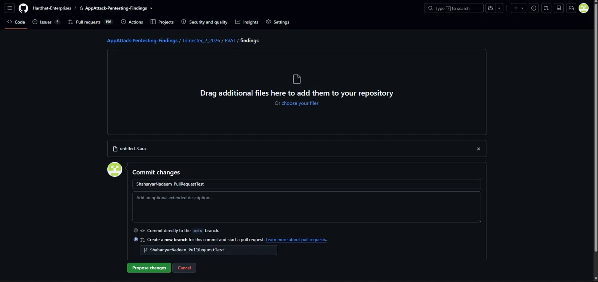
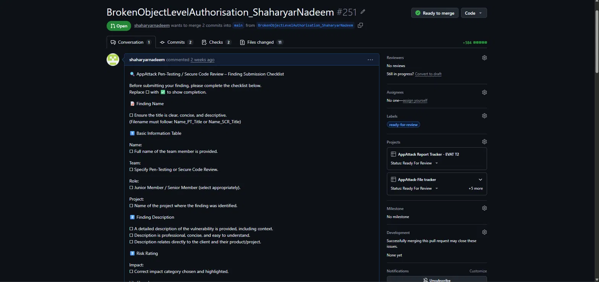

{/* Components*/}
import Footer from '../../../../components/credits.astro'

## Submitting a Pull Request for a Pentest Finding

This is the process for submitting a finding to the `AppAttack-Pentesting-Findings` repository.

### 1. Navigate to the repository and your Trimester
Open the `AppAttack-Pentesting-Findings` repository, then open the folder for the Trimester you're currently in.

### 2. Open your project's findings folder
Open the folder for the project you found the vulnerability in, then open its `findings` folder.

### 3. Upload your finding files
Click **Add file → Upload files**.

Give the commit a clear title, then upload all files related to the finding — your LaTeX report and any supporting screenshots.

### 4. Create a new branch — never commit to main
When prompted where to commit, select **Create a new branch for this commit and start a pull request**. Click **Propose changes**.

### 5. Apply the correct label and add to project boards
On your new PR, apply the correct workflow label: `work-in-progress` if you're still writing, or `ready-for-review` once it's ready for a reviewer.

Add the PR to both:
- the project board for the specific project you're testing (e.g. *AppAttack Report Tracker*), and
- the **AppAttack File Tracker** board.

Leave **Assignees** untouched — do not assign yourself or anyone else.

### 6. Create the pull request and update status
Click **Create pull request**. Then update the **Status** field on both project boards to reflect where the finding is in the pipeline (e.g. "Ready For Review").

<Footer />
